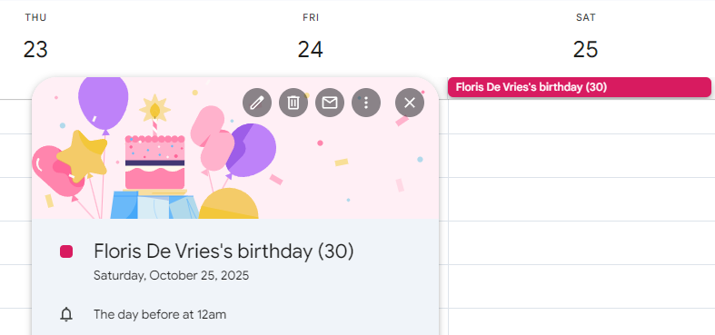

# 🎉 Auto-Birthdays

This Google Apps Script creates birthday events in your Google Calendar based on your Google Contacts.

---

## 🚀 Getting Started

This project uses **Google Apps Script** and the **Google People API**.

1. Open [Google Apps Script](https://script.google.com/) and create a new project.
2. Paste the contents of `code.gs` into the editor.
3. In the left sidebar, go to **Services** and add the **People API**.
4. Modify the `CONFIG` section at the top of the script (see below).
5. Run `loopThroughContacts()` once to:
   - Generate birthday events
   - Optionally clean up outdated ones
   - Set up a time-based trigger (if enabled)

> **⚠️ DATA-LOSS WARNING**  
> The script **deletes any all-day event whose date and title look like a birthday** so it can rebuild a clean set each run.  
> That can accidentally match anniversaries, retirements, “Remembrance”, etc.  
> **Protect yourself:**
> 1. **Use a separate calendar** (create one called “Birthdays”) and point `CONFIG.calendarId` to it.  
> 2. Keep `CONFIG.cleanupEvents = false` until you have verified everything on a test calendar.
> 3. If something disappears, restore it from **Calendar Trash/Bin** within 30 days.

---

## ⚙️ Configuration

The CONFIG object gives you full control over how events are created and managed:

```javascript
const CONFIG = {
  calendarId: 'primary',             // 'primary' or your custom calendar ID

  // Title customization
  useEmoji: true,                    // Add 🎂 emoji to event titles
  showYearOrAge: true,               // Recurrence on: shows (*YYYY), off: shows (age)
  showAgeOnRecurring: false,         // If true, shows (age) on recurring events instead of (*YYYY)
  
  // Language and localization
  language: 'en',                    // Language code: 'en' (English), 'it' (Italian), etc.
  titleFormat: '{emoji}{name} ({ageOrYear})', // Title format template (see below for placeholders)

  // Recurrence
  useRecurrence: true,               // Create recurring yearly events
  futureYears: 20,                   // Recurring events end this many years in the future
  pastYears: 2,                      // Recurring events start this many years in the past

  // Reminder settings
  useReminders: true,                // Enable/disable popup reminders for birthday events
  reminderMinutesBefore: 1440,       // Popup reminder time (in minutes) - only used if useReminders is true
                                     // Common values: 0 = at event time, 60 = 1 hour before, 1440 = 1 day before, 10080 = 1 week before

  // Availability settings
  setTransparency: false,            // Events display you as busy by default (Transparency OPAQUE). Set to true to display you as available (Transparency TRANSPARENT).

  // Cleanup
  cleanupEvents: false,               // ⚠️⚠️⚠️ Deletes all matching birthday events between ±100 years

  // Trigger options
  useTrigger: true,                  // Automatically run on a schedule
  triggerFrequency: 'daily',         // 'daily' or 'hourly'
  triggerHour: 4,                    // If 'daily', the hour of day to run (0–23)

  // Script identification
  scriptKey: 'CREATED_BY_Auto-Birthdays', // Unique identifier for events created by this script

  // Contact label filtering (optional)
  useLabels: false,                  // Enable filtering contacts by labels
  contactLabels: [],                 // Array of contact label IDs to include (e.g. ['abc123'])

  // Month filtering (optional)
  useMonthFilter: false,             // Enable filtering contacts by birth month
  filterMonths: []                   // Array of months to include (1-12), e.g. [1, 2, 4] for Jan, Feb, Apr
};
```

---

## 🏷 Contact Label Filtering

You can optionally filter which contacts are processed based on their labels (contact groups). This is useful if you only want birthday events for specific groups of contacts.

### How to Use Labels

1. **Find your label IDs**:
   - Open https://contacts.google.com/
   - Click on your desired label/group
   - Note the page address: `https://contacts.google.com/label/[contactLabelID]`
   - The last part of the address is your `contactLabelID`

2. **Configure label filtering**:
   ```javascript
   const CONFIG = {
     // ... other settings
     useLabels: true,                           // Enable label filtering
     contactLabels: ['abc123']                  // Only process contacts with this label
   };
   ```

3. **Run the script** - only contacts with the specified labels will have birthday events created.

### Configuration Options

| Setting | Description | Default | Example |
|---------|-------------|---------|---------|
| `useLabels` | Enable/disable label filtering | `false` | `true` |
| `contactLabels` | Array of contact label IDs to include | `[]` | `['abc123', 'def456']` |

## 📅 Month Filtering

To improve performance and reduce the risk of timeouts, this filter can be used to process contacts in smaller groups. You can optionally filter which contacts are processed based on the month of their birthday.

> **⏱️ EXECUTION TIME LIMIT**  
> Google Apps Script has a **6-minute maximum execution time**. If you have many contacts, the script may timeout before completing. Use month filtering to process contacts in smaller batches, or simply re-run the script to continue where it left off.

### How to Use Month Filtering

1. **Configure month filtering**:
   ```javascript
   const CONFIG = {
     // ... other settings
     useMonthFilter: true,             // Enable month filtering
     filterMonths: [1, 2, 3]          // Only process contacts with birthdays in Jan, Feb, Mar
   };
   ```

2. **Run the script** - only contacts with birthdays in the specified months will have birthday events created.

### Configuration Options

| Setting | Description | Default | Example |
|---------|-------------|---------|---------|
| `useMonthFilter` | Enable/disable month filtering | `false` | `true` |
| `filterMonths` | Array of months to include (1-12) | `[]` | `[1, 2, 4]` for January, February, April |

## 🌍 Language and Localization

The script supports multiple languages for event titles and descriptions. You can customize both the language and the title format to suit your preferences.

### Available Languages

Currently supported languages:
- **English** (`'en'`) - Default
- **Italian** (`'it'`)
- **French** (`'fr'`)
- **German** (`'de'`)
- **Spanish** (`'es'`)

### Title Format Templates

You can customize the event title format using these placeholders:

| Placeholder | Description | Example |
|-------------|-------------|---------|
| `{emoji}` | Birthday emoji (🎂 ) if enabled | 🎂 |
| `{name}` | Person's name | John Doe |
| `{age}` | Person's age | 36 |
| `{ageOrYear}` | Age or birth year (*YYYY) based on settings | 36 or *1988 |
| `{ageText}` | Age with language-specific year/years word | 36 years |
| `{birthYear}` | Birth year | 1988 |
| `{birthday}` | Localized word for "birthday" | birthday / compleanno |
| `{years}` | Localized word for "years" | years / anni |
| `{year}` | Localized word for "year" (singular) | year / anno |

### Language Examples

**English Configuration:**
```javascript
language: 'en',
titleFormat: '{emoji}{name} ({ageOrYear})'        // 🎂 John Doe (36)
// or
titleFormat: '{emoji}{name}\'s birthday - {age} years'  // 🎂 John Doe's birthday - 36 years
```

**Italian Configuration:**
```javascript
language: 'it',
titleFormat: '{emoji}Compleanno di {name} - {age} anni'       // 🎂 Compleanno di John Doe - 36 anni
// or
titleFormat: '{emoji}{name} - {ageText}'                // 🎂 John Doe - 36 anni
```

**French Configuration:**
```javascript
language: 'fr',
titleFormat: '{emoji}Anniversaire de {name} - {age} ans'      // 🎂 Anniversaire de John Doe - 36 ans
// or
titleFormat: '{emoji}{name} - {ageText}'                // 🎂 John Doe - 36 ans
```

**German Configuration:**
```javascript
language: 'de',
titleFormat: '{emoji}Geburtstag von {name} - {age} Jahre'     // 🎂 Geburtstag von John Doe - 36 Jahre
// or
titleFormat: '{emoji}{name} - {ageText}'                // 🎂 John Doe - 36 Jahre
```

**Spanish Configuration:**
```javascript
language: 'es',
titleFormat: '{emoji}Cumpleaños de {name} - {age} años'       // 🎂 Cumpleaños de John Doe - 36 años
// or
titleFormat: '{emoji}{name} - {ageText}'                // 🎂 John Doe - 36 años
```

### Custom Title Formats

You have two ways to customize titles:

1. **Use built-in language formats** - Set `language` to use the default format for that language
2. **Custom format** - Set your own template in `titleFormat` with any placeholders you want

---

## 🖋️ Event Title Formats

Depending on your configuration, birthday events will appear with different formats. Here are examples for different languages:

### English Examples (`language: 'en'`)

| `useEmoji` | `useRecurrence` | `showYearOrAge` | `showAgeOnRecurring` | `Event Title Example`     |
|------------|-----------------|-----------------|---------------------|---------------------------|
| true       | true            | true            | false               | 🎂 John Doe (*1988)       |
| true       | true            | true            | true                | 🎂 John Doe (36)          |
| true       | false           | true            | N/A                 | 🎂 John Doe (36)          |
| false      | true            | false           | N/A                 | John Doe                  |
| false      | false           | true            | N/A                 | John Doe (36)             |
| false      | false           | false           | N/A                 | John Doe                  |

### Custom Format Examples

```javascript
// English birthday style
titleFormat: '{emoji}{name}\'s birthday - {age} years'
// Result: 🎂 John Doe's birthday - 36 years

// Simple format
titleFormat: '{emoji}{name} - {age}'  
// Result: 🎂 John Doe - 36

// Italian with age text
titleFormat: '{emoji}{name} compie {ageText}'
// Result: 🎂 John Doe compie 36 anni
```

**Notes:**
- `showAgeOnRecurring` only applies when `useRecurrence=true` and `showYearOrAge=true`
- If no birth year is provided, age or year is omitted
- When `showAgeOnRecurring=true`, individual events are created for each year instead of recurring events:
  - 2025: 🎂 John Doe (30)
  - 2026: 🎂 John Doe (31) 
  - 2027: 🎂 John Doe (32)
- This allows you to see all future birthdays with correct ages when browsing your calendar
- Individual events span from `pastYears` to `futureYears` relative to the current year

> Review the [Configuration section](#️-configuration) to understand all available settings.

> **⏱️ EXECUTION TIME LIMIT**  
> Google Apps Script has a **6-minute maximum execution time**. The script may timeout before completing if you have:
> - A large number of contacts (hundreds or thousands)
> - Large year spans (`pastYears` + `futureYears` > 40)
> - Both `useRecurrence=false` and `showAgeOnRecurring=true` (creates individual events for each year)
>
> **To reduce timeout risk:**
> - Start with smaller year spans (e.g., `pastYears: 1`, `futureYears: 10`)
> - Use [month filtering](#-month-filtering) to process contacts in batches
> - If the script times out, simply **re-run it** - it will continue where it left off
> - Consider using `useRecurrence=true` for better performance with large datasets

---

## 🧹 Automatic Cleanup

If `CONFIG.cleanupEvents` is enabled:

- Search your calendar between 100 years in the past and future
- Find outdated or duplicate birthday events **created by this script only**
- Delete them safely, including recurring series
- Manual birthday events are never touched

**Safety Note**: The cleanup only affects events containing the script's unique identifier, ensuring your manually created events remain safe.

---

## ⏰ Trigger Behavior

If `CONFIG.useTrigger` is enabled:

- Automatically create a **time-based trigger**
- Run either:
  - **Hourly** every hour
  - Or **Daily** at `triggerHour`

🛠️ If you change the trigger settings, the script will:
- **Remove any existing trigger**
- **Install a new one with the updated config**

This ensures only **one correct trigger** is active.

---

## 🔑 Script Identification

The script uses a unique key system to identify events it has created:

- **`scriptKey`**: A unique identifier embedded in each event's description
- **Safe operation**: Only modifies events it has created, leaving manual birthday events untouched
- **Easy identification**: You can search for events created by the script using the key
- **Version tracking**: Update the key for different script versions if needed

**How it works:**
- Each created event includes `[CREATED_BY_Auto-Birthdays]` in its description
- The script only deletes/updates events containing this identifier
- Manual birthday events are completely safe from script operations

---

## 🗓️ Examples

You'll see all-day birthday events appear in your calendar like these:

- 🎂 John Doe (*1988)
- 🎂 Jane Smith (36)
- John Appleseed (no year provided)

All events appear as **all-day events** on the person’s birthday.



---

## 🧰 Troubleshooting

If you encounter issues:

- Check the **Apps Script execution log**
- Run the script **manually the first time** to authorize permissions
- Ensure you've **enabled the People API** under **Services**
- Make sure you've granted **Calendar and Contacts permissions**
- **Script timeout**: If execution stops due to the 6-minute limit, simply re-run the script to continue processing
- Restore missing items via Calendar → Trash/Bin.

---

## 🤝 Contributing

Contributions are welcome! Fork this repo, improve it, and submit a pull request.

---

## 📄 License

This script is released under the **MIT License**.

---

## 💬 Contact

For support or feedback, please [file an issue](https://github.com/FlorisDeVries/Auto-Birthdays/issues).
